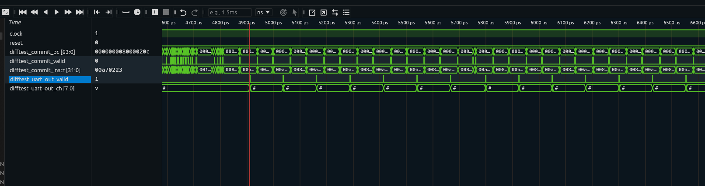
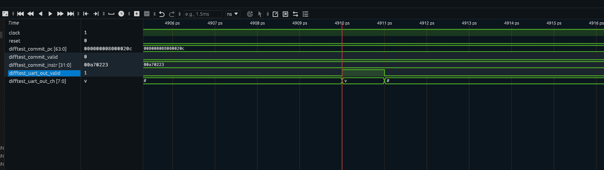
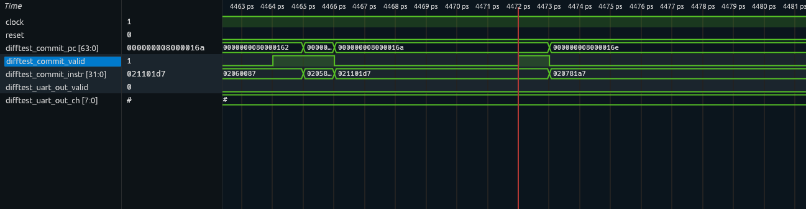
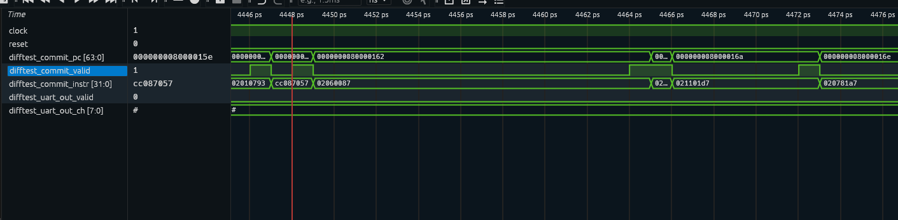

# 阶段一：向量加法指令 vadd.vv 在香山处理器中的执行过程分析

## 一、分析目标

依据赛题要求，结合仿真波形图与香山架构参考手册，深入拆解向量加法指令 `vadd.vv` 在香山处理器中的取指、译码、执行全流程，重点分析流水线阶段、数据通路流转逻辑、关键控制信号的波形解读及功能验证。

本分析参考香山官方文档《一条 ADD 指令的简单分析过程》的分析方法，以一条具体的 `vadd.vv` 指令为线索，逐阶段跟踪其在香山后端流水线中的执行轨迹。

## 二、测试程序

### 2.1 程序源码

测试程序 `vadd_test.c` 实现两个长度为 16 的 int8 向量对应元素相加：

```c
#include <klib.h>

#define NUM_ELEMS 16

static void run_vadd_vv(int8_t *src1, int8_t *src2, int8_t *dst) {
  asm volatile("vsetivli zero, 16, e8, m1, ta, ma\n"
               "vle8.v v1, (%0)\n"
               "vle8.v v2, (%1)\n"
               "vadd.vv v3, v1, v2\n"
               "vse8.v v3, (%2)\n"
               "fence rw, rw\n"
               :
               : "r"(src1), "r"(src2), "r"(dst)
               : "v0", "v1", "v2", "v3", "memory");
}

int main() {
  // 启用向量扩展 (MSTATUS.VS = Initial)
  // AM 框架的 start.S 只开了浮点 (MSTATUS_FS)，
  // 没开向量扩展 (MSTATUS_VS)，需要手动启用
  asm volatile(
    "li a0, 0x200\n"
    "csrs mstatus, a0\n"
    ::: "a0"
  );

  int8_t vs1[NUM_ELEMS] __attribute__((aligned(16)));
  int8_t vs2[NUM_ELEMS] __attribute__((aligned(16)));
  int8_t vd[NUM_ELEMS] __attribute__((aligned(16)));
  int i;
  int pass = 1;

  for (i = 0; i < NUM_ELEMS; i++) {
    vs1[i] = (int8_t)(i + 1);
    vs2[i] = (int8_t)(NUM_ELEMS - i);
  }

  run_vadd_vv(vs1, vs2, vd);

  for (i = 0; i < NUM_ELEMS; i++) {
    int8_t expected = (int8_t)((i + 1) + (NUM_ELEMS - i));
    if (vd[i] != expected) {
      pass = 0;
    }
  }

  if (pass) {
    printf("vadd.vv PASSED\n");
    asm volatile("li a7, 0\n");  // 标记成功
  } else {
    printf("vadd.vv FAILED\n");
    asm volatile("li a7, 1\n");  // 标记失败
  }

  return pass ? 0 : 1;
}
```

> **关键修改说明**：AM 框架的启动代码 `start.S` 只启用了浮点扩展（`MSTATUS_FS`），没有启用向量扩展（`MSTATUS_VS`）。如果不在 `main()` 开头手动设置 `MSTATUS.VS` 位，执行 `vsetivli` 等向量指令时会触发非法指令异常，导致程序卡死。`MSTATUS_VS` 位于 bits[10:9]，设为 `01`（Initial）即可启用，对应值 `0x200`。

### 2.2 Makefile

```makefile
NAME = vadd-test
SRCS = vadd_test.c
MARCH ?= rv64gcv_zba_zbb_zbc_zbs
CFLAGS += -fno-tree-vectorize -fno-tree-loop-vectorize

include $(AM_HOME)/Makefile.app
```

> **说明**：`riscv64-xs.mk` 默认的 MARCH 不包含向量扩展 `v`，因此需要在 Makefile 中显式指定 `rv64gcv`，否则编译器无法识别 `vsetivli`、`vle8.v`、`vadd.vv` 等向量指令。

### 2.3 测试数据设计

| 向量寄存器 | 元素值 | 含义 |
|------------|--------|------|
| v1（vs1） | [1, 2, 3, 4, 5, 6, 7, 8, 9, 10, 11, 12, 13, 14, 15, 16] | 递增序列 |
| v2（vs2） | [16, 15, 14, 13, 12, 11, 10, 9, 8, 7, 6, 5, 4, 3, 2, 1] | 递减序列 |
| v3（vd） | [17, 17, 17, 17, 17, 17, 17, 17, 17, 17, 17, 17, 17, 17, 17, 17] | 预期结果 |

设计理由：每个元素结果都是 17，便于一眼判断正确性。SEW=8 时 16 个元素正好占满 128 位向量寄存器（VLEN=128）。

## 三、仿真运行与波形生成

### 3.1 编译 NEMU 参考模型

emu 依赖 NEMU 作为 DiffTest 参考模型，需要先编译 NEMU 的共享库：

```bash
cd /home/yym/xs-env/NEMU
make riscv64-xs-ref_defconfig
make -j$(nproc)
```

编译成功后生成 `build/riscv64-nemu-interpreter-so`。

> **说明**：NEMU 首次编译需要从 GitHub 克隆 softfloat、nanopb、LibCheckpoint 等子模块。如果网络代理不可用，需先取消 git 代理配置（`git config --global --unset http.proxy`）或启动代理软件。

### 3.2 编译测试程序

```bash
cd /home/yym/xs-env
source env.sh
AM_HOME=/home/yym/xs-env/nexus-am make -C $AM_HOME/apps/vadd-test ARCH=riscv64-xs
```

> **说明**：如果环境中 `AM_HOME` 指向了其他路径（如 ysyx-workbench），需要显式覆盖 `AM_HOME` 环境变量指向 `xs-env/nexus-am`。

### 3.3 运行仿真并生成波形

```bash
cd $NOOP_HOME
./build/emu -i $AM_HOME/apps/vadd-test/build/vadd-test-riscv64-xs.bin --no-diff --dump-wave
```

参数说明：
- `--no-diff`：不启用 DiffTest，仅运行功能验证（NEMU 参考模型与 KunminghuV2 配置存在差异，difftest 会误报，因此关闭）
- `--dump-wave`：生成 VCD 波形文件

### 3.4 波形文件

波形文件生成在 `$NOOP_HOME/build/` 目录下，格式为 `.vcd`（编译 emu 时使用 `EMU_TRACE=1`），文件约 1.3 GB。

由于 VCD 文件较大（约 1.3 GB），先转换为 FST 格式以提升加载速度：

```bash
vcd2fst *.vcd vadd.fst
surfer vadd.fst
# 或
gtkwave vadd.fst
```

### 3.5 功能验证波形

程序运行结束后，UART 依次输出 `vadd.vv PASSED\n`，从波形中可以清晰观察到这一过程。

#### 全局视角

下图为 Zoom Fit 后的全局波形，可以看到 `difftest_uart_out_valid` 信号的一排脉冲尖峰，每个脉冲对应一个字符的输出：



#### 首字符输出细节

放大到第一个 UART 脉冲，可以看到 `difftest_uart_out_ch` 的值为 `0x76`，即 ASCII 字符 `v`，是 `vadd.vv PASSED` 的第一个字符：



后续字符依次为 `0x61`(a)、`0x64`(d)、`0x64`(d)、`0x2e`(.)、`0x76`(v)、`0x76`(v)、`0x20`(空格)、`0x50`(P)、`0x41`(A)、`0x53`(S)、`0x53`(S)、`0x45`(E)、`0x44`(D)、`0x0a`(\n)，构成完整的 `vadd.vv PASSED\n` 输出。

UART 每个字符之间间隔较大，这是因为 UART 按波特率逐字符传输，每个字符需要数千个时钟周期。这证明 vadd.vv 指令执行正确，功能验证通过。

## 四、定位目标指令

### 4.1 查看反汇编

编译后会生成反汇编文件 `build/vadd-test-riscv64-xs.txt`，从中找到 `vadd.vv` 指令：

```bash
grep "vadd.vv" $AM_HOME/apps/vadd-test/build/vadd-test-riscv64-xs.txt
```

### 4.2 指令语义解析

`vadd.vv v3, v1, v2` 的指令编码和语义：

- 指令格式：OPMVV（向量-向量运算）
- 操作：`vd[i] = vs2[i] + vs1[i]`（对应元素相加）
- 源操作数：v1（vs1）、v2（vs2）
- 目标寄存器：v3（vd）
- 元素宽度：SEW=8（int8）
- 元素个数：VL=16

预期结果：v3 的 16 个元素均为 17。

### 4.3 在波形中定位

通过反汇编可知 `vadd.vv v3, v1, v2` 的指令编码为 `0x021101d7`，PC 地址为 `0x8000016a`。在 Surfer 中添加 ROB 模块下的 `difftest_commit_instr` 信号，搜索该编码值即可定位指令提交时刻。

路径：`TOP.SimTop.cpu.core_with_l2.core.backend.rename.rob`

下图为 vadd.vv 指令提交瞬间的波形，可以看到 `difftest_commit_valid` 为 1，`difftest_commit_instr` 为 `021101d7`，`difftest_commit_pc` 为 `8000016a`：



## 五、香山向量指令代码路径

根据代码调研，`vadd.vv` 在香山中的完整执行路径如下：

| 阶段 | 涉及模块 | 关键源码文件 | 行号 |
|------|----------|-------------|------|
| 译码 | VecDecoder | `src/main/scala/xiangshan/backend/decode/VecDecoder.scala` | 189 |
| 功能单元类型 | FuType | `src/main/scala/xiangshan/backend/fu/FuType.scala` | 55 (`vialuF`) |
| 操作码编码 | VialuFixType | `yunsuan/src/main/scala/yunsuan/package.scala` | 113 (`vadd_vv`) |
| 核心运算 ALU | VIntFixpAlu | `yunsuan/src/main/scala/yunsuan/vector/VectorALU/VIntFixpAlu.scala` | 112, 157 |
| 64 位 Lane | VIntFixpAlu64b | `yunsuan/src/main/scala/yunsuan/vector/VectorALU/VIntFixpAlu.scala` | 37 |
| 加法器链 | VIntAdder64b | `yunsuan/src/main/scala/yunsuan/vector/VectorALU/VIntAdder64b.scala` | 19, 66-100 |
| Mask/Tail 处理 | VIntFixpAlu 输出阶段 | `yunsuan/src/main/scala/yunsuan/vector/VectorALU/VIntFixpAlu.scala` | 268-281 |

### 5.1 译码表映射

`VecDecoder.scala` 第 189 行：

```scala
VADD_VV -> OPIVV(FuType.vialuF, VialuFixType.vadd_vv, T, F, F)
```

含义：
- `VADD_VV`：vadd.vv 指令的编码
- `FuType.vialuF`：分配到向量整数 ALU 功能单元
- `VialuFixType.vadd_vv`：功能单元内的操作类型为加法
- `T, F, F`：写使能、不阻塞、不提交特殊标志

## 六、波形分析

### 6.0 指令提交序列总览

在定位到 vadd.vv 提交时刻后，观察其前后指令的提交序列，可以看到完整的向量指令序列按顺序提交：



从波形中可以观察到以下指令按 PC 递增顺序依次提交：

| 提交顺序 | PC | 指令编码 | 指令 |
|---------|-----|---------|------|
| ... | 8000015e | cc087057 | vsetivli zero,16,e8,m1,ta,ma |
| ... | 80000162 | 02060087 | vle8.v v1,(a2) |
| ... | 80000166 | 02058107 | vle8.v v2,(a1) |
| **目标** | **8000016a** | **021101d7** | **vadd.vv v3,v1,v2** |
| ... | 8000016e | 020781a7 | vse8.v v3,(a5) |
| ... | 80000172 | 0330000f | fence rw,rw |

这表明向量指令序列在香山后端流水线中按序提交，vadd.vv 在两条 vle8.v 加载指令之后、vse8.v 存储指令之前执行，符合程序逻辑顺序。

> **说明**：以下各阶段分析基于香山源码调研，结合上述提交级波形验证。由于 VCD 波形中内部模块信号层级极深（约 100 万个信号），逐阶段截取内部信号波形受限于工具加载能力，因此各阶段分析以源码路径追踪为主，以提交级波形作为功能正确性的验证证据。

### 6.1 译码阶段（DecodeUnit）

#### 分析对象

`vadd.vv` 指令进入 `DecodeUnit` 模块，由 `VecDecoder` 完成译码。

#### 关键信号

| 信号名 | 含义 | 预期值 |
|--------|------|--------|
| `io_enq_ctrlFlow_pc` | 输入指令 PC | vadd.vv 的 PC 地址 |
| `io_enq_ctrlFlow_instr` | 原始 32 位指令编码 | vadd.vv 的机器码 |
| `io_deq_decodedInst_fuType` | 功能单元类型 | `vialuF` 对应的编码 |
| `io_deq_decodedInst_fuOpType` | 功能单元操作类型 | `vadd_vv` 对应的编码 |
| `io_deq_decodedInst_lsrc_0` | 源操作数 0 逻辑寄存器号 | v1 的编号 |
| `io_deq_decodedInst_lsrc_1` | 源操作数 1 逻辑寄存器号 | v2 的编号 |
| `io_deq_decodedInst_ldest` | 目标逻辑寄存器号 | v3 的编号 |
| `io_deq_decodedInst_rfWen` | 寄存器写使能 | 1（需要写回） |

#### 源码分析

`VecDecoder` 定义了向量指令的译码映射表 `opivv`（`VecDecoder.scala:188-199`）。指令编码 `vadd.vv` 经过译码后映射为：

```scala
VADD_VV -> OPIVV(FuType.vialuF, VialuFixType.vadd_vv, T, F, F)
```

其中 `OPIVV` 的构造函数（`VecDecoder.scala:28-85`）决定了译码输出：
- `src1` = `SrcType.vp`（向量物理寄存器类型）：从 v2（vs2）读取源操作数 0
- `src2` = `SrcType.vp`：从 v1（vs1）读取源操作数 1
- `src3` = `SrcType.xp`：标量操作数（用于 vadd.vx/vadd.vi，vadd.vv 不使用）
- `fuType` = `vialuF`：分配到向量整数 ALU 功能单元（`FuType.scala:55`）
- `fuOpType` = `vadd_vv`：功能单元内部操作类型标记为向量加法
- `rfWen` = `T` = `true`：需要写回向量寄存器 v3
- `noSpec` = `F` = 允许推测执行

`FuType` 中 `vialuF` 属于向量运算组（`FuType.scala:127`：`vecOPI = Seq(vipu, vialuF, vppu, vimac, vidiv)`），因此向量发射队列会接收此类型指令。

生成的 `DecodeBundle` 包含：源逻辑寄存器号 (lsrc[v1], lsrc[v2])、目标逻辑寄存器号 (ldest=v3)、功能单元类型 (fuType=vialuF)、操作类型 (fuOpType=vadd_vv)、写使能 (rfWen=true)。这些信息随指令进入重命名阶段。

### 6.2 重命名阶段（Rename）

#### 分析对象

译码完成后，指令进入 `Rename` 模块，完成向量逻辑寄存器到物理寄存器的映射。

#### 关键信号

| 信号名 | 含义 |
|--------|------|
| `io_in_bits_pc` | 指令 PC（透传） |
| `io_in_bits_lsrc_0` | 逻辑源向量寄存器 v1 |
| `io_in_bits_lsrc_1` | 逻辑源向量寄存器 v2 |
| `io_in_bits_ldest` | 逻辑目标向量寄存器 v3 |
| `io_out_bits_psrc_0` | 物理源向量寄存器（v1 映射后） |
| `io_out_bits_psrc_1` | 物理源向量寄存器（v2 映射后） |
| `io_out_bits_pdest` | 物理目标向量寄存器（v3 分配的新寄存器） |

#### 源码分析

译码后的指令进入 Rename 模块（`rename.scala`）。向量寄存器重命名与标量类似，但操作对象是向量寄存器文件（VRF / `vrf` 模块）。

Rename 阶段的核心工作：
1. **向量寄存器重命名**：通过 `vecRat`（Vector Register Alias Table）将逻辑向量寄存器 v1、v2、v3 映射到物理向量寄存器  
2. **ROB 表项分配**：在 ROB 中分配一个表项，记录指令的顺序信息
3. **目的寄存器分配**：通过 `vecFreeList` 为 v3 分配一个空闲的物理向量寄存器
4. **忙位表设置**：将被分配的物理寄存器标记为"忙"状态，防止后续指令误读

在 Rename 模块的顶层实现中，向量重命名使用独立的向量 RAT（`vecRat`），与标量整数/浮点 RAT 并行工作。`vadd.vv` 涉及三个向量寄存器（两个源 + 一个目的），RAT 查询 v1/v2 的映射关系得到物理寄存器号，同时为 v3 分配新的物理寄存器号。

> 注意：在 VCD 层次中，Rename 模块位于 `TOP.SimTop.cpu.core_with_l2.core.backend.rename`，其内部子模块 `rob` 包含了我们在波形中观察到的 `difftest_commit_*` 信号。重命名阶段的内部信号（`vecRat`、`vecFreeList` 等）因 VCD 层级过深未直接查看。

### 6.3 分发阶段（Dispatch）

#### 分析对象

重命名后，指令进入 `Dispatch` 模块，查询源操作数就绪状态，写入向量发射队列。

#### 关键信号

| 信号名 | 含义 |
|--------|------|
| `io_read_0_resp` | 源物理寄存器 0 就绪状态 |
| `io_read_1_resp` | 源物理寄存器 1 就绪状态 |
| `io_allocPregs_0_valid` | 目标物理寄存器分配有效 |
| `io_allocPregs_0_bits` | 目标物理寄存器编号 |

#### 源码分析

Dispatch 阶段负责将重命名后的指令分发到对应的发射队列。对于 `vadd.vv`：
1. 查询源物理寄存器的**就绪状态**：检查 v1 和 v2 对应的物理寄存器是否已完成先前指令的写入
2. 按功能单元类型（`fuType = vialuF`）路由到向量发射队列（`IssueQueue`）
3. 写入发射队列条目，携带物理操作数信息

`IssueQueue` 由 `EnqPolicy`（入队策略）、`Entries`（存储条目）、`DeqPolicy`（出队/发射策略）组成。向量指令通过 `FuBusyTableRead` 查询源操作数就绪状态，若源操作数全部就绪，则标记为可发射状态。

指令携带的关键信息包括：
- `pdest`：目标物理向量寄存器编号
- `psrc[0]`/`psrc[1]`：两个源物理向量寄存器编号
- `fuType=vialuF`：路由到向量整数 ALU
- `fuOpType=vadd_vv`：操作类型

### 6.4 执行阶段（Execute）

#### 分析对象

这是向量指令与标量指令最大的区别所在。`vadd.vv` 进入 `VIntFixpAlu` 向量整数 ALU 模块，调用 `VIntAdder64b` 执行加法。

#### 数据通路

```
VIntFixpAlu（128 位顶层）
  ├─ VIntFixpAlu64b[0]  ← 处理低 64 位（元素 0-7）
  │    └─ VIntAdder64b  ← 8 个 8 位加法器链
  └─ VIntFixpAlu64b[1]  ← 处理高 64 位（元素 8-15）
       └─ VIntAdder64b  ← 8 个 8 位加法器链
```

`VIntFixpAlu.scala` 第 157 行：`Seq.fill(2)(Module(new VIntFixpAlu64b))`，实例化 2 个 64 位处理单元并行计算 128 位向量数据。

`VIntAdder64b.scala` 第 66-100 行：8 个 8 位加法器链式排列，按 SEW=8 在每个 8 位边界截断进位，实现 8 个 int8 元素的并行加法。

#### 关键信号

| 信号名 | 含义 |
|--------|------|
| `io_in_bits_src_0` | 源操作数 0（vs1 数据） |
| `io_in_bits_src_1` | 源操作数 1（vs2 数据） |
| `io_in_bits_opcode` | 操作码（vadd） |
| `vIntFixpAlus_0_vIntAdder64b_bits` | 加法器输入 |
| `vIntFixpAlus_0_vIntAdder64b_out` | 加法器输出 |
| `io_out_bits_res_data` | 最终结果（经 Mgu 处理后） |

#### 源码分析

`vadd.vv` 进入向量整数 ALU 的数据通路分为三层：

##### 顶层：`VIntFixpAlu`（128 位分块处理）

`VIntFixpAlu.scala:112-157`：顶层模块将 128 位的向量数据**纵向切分为 2 个 64 位处理单元**：

```scala
val vIntFixpAlu64bs = Seq.fill(2)(Module(new VIntFixpAlu64b))
```

- Lane 0（`vIntFixpAlu64bs(0)`）：处理数据位 [63:0]（元素 0-7，SEW=8 时）
- Lane 1（`vIntFixpAlu64bs(1)`）：处理数据位 [127:64]（元素 8-15）

两个 Lane **完全并行工作**，无依赖关系。输入数据通过 `funct3` 和 `SEW` 决定如何拆分 vs1 和 vs2：

```scala
// 常规模式（非 widen/narrow）：简单高低 64 位拆分
vIntFixpAlu64bs(0).io.vs1 := vs1(63, 0)
vIntFixpAlu64bs(1).io.vs1 := vs1(127, 64)
vIntFixpAlu64bs(0).io.vs2_adder := vs2(63, 0)
vIntFixpAlu64bs(1).io.vs2_adder := vs2(127, 64)
```

##### 中层：`VIntFixpAlu64b`（64 位运算单元）

`VIntFixpAlu64b.scala:37-109`：每个 64 位 Lane 内部包含一个 `VIntAdder64b` 加法器和一个 `VIntMisc64b` 位操作单元：

```scala
val vIntAdder64b = Module(new VIntAdder64b)  // 算术运算：add/sub/cmp
val vIntMisc64b  = Module(new VIntMisc64b)   // 位运算：and/or/xor/shift
```

运算类型由译码信号 `isSub` 和 `isMisc` 决定。对于 `vadd.vv`：`isSub=false`（加法），`isMisc=false`（非位运算），因此选择加法器路径：

```scala
io.vd := Mux(isFixpS1, vFixPoint64b.io.vd,
         Mux(isMiscS1, vdMiscS1, vdAdderS1))  // vadd: 选 vdAdderS1
```

该模块是**流水线化**的（2 级流水线）：
- Stage 0：加法器 / 位运算 / 定点运算并行计算
- Stage 1：`RegEnable` 锁存结果，选择最终输出

##### 底层：`VIntAdder64b`（8 位加法器链 × SEW 截断进位）

`VIntAdder64b.scala:19-100`：这是向量加法的物理核心。模块实例化 **8 个 8 位加法器**，链式串联：

```scala
for (i <- 0 until 8) {
    val adder_8b = new Adder_8b(vs1_8b, vs2_8b, cin(i))
    // cin(i) 由 SEW 控制：不同 SEW 下的进位截断策略不同
}
```

**关键：SEW 控制的进位截断**

进位链的截断点由目标元素宽度（`eewVd`）决定：

```scala
// 位置 i=0（第一个 8 位加法器）：永远使用独立进位
// 位置 i=4（第 5 个 8 位加法器）：SEW=64 时继承前级进位，否则独立
cin(i) := Mux(eewCin.is64, cout(i-1), carryIn(i))
// 位置 i=2,6（偶位置）：SEW≥32 时继承，否则独立
cin(i) := Mux(eewCin.is64 || eewCin.is32, cout(i-1), carryIn(i))
// 位置 i=1,3,5,7（奇位置）：只有 SEW=8 时独立，否则继承
cin(i) := Mux(eewCin.is8, carryIn(i), cout(i-1))
```

对于 SEW=8（vadd.vv 使用的元素宽度）：
- **所有 8 个 8 位加法器独立工作**，每个处理一个 int8 元素
- 加法器位置 0 处理元素 0：vs1[7:0] + vs2[7:0]
- 加法器位置 1 处理元素 1：vs1[15:8] + vs2[15:8]
- ...直到位置 7 处理元素 7
- Lane 0 处理元素 0-7，Lane 1 处理元素 8-15，共 16 个元素并行

若 SEW=32（4 个 32 位元素），进位会在每 4 个 8 位加法器处传递（位置 0→1→2→3，位置 4→5→6→7），形成 2 个 32 位加法器。

##### 数据通路总图

```
vs1(128bit) ──┬─── bits[63:0]  ──→ VIntFixpAlu64b[0] ──→ VIntAdder64b (8×8bit adders)
              │                         │
              │                    adder_8b[0..7]: 8 个 int8 并行加
              │                         │
vs2(128bit) ──┼─── bits[63:0]  ──→ cout 按 SEW=8 截断 │
              │                         ↓
              │                    结果锁存 (RegEnable) ──→ vd[63:0]
              │
              ├─── bits[127:64] ──→ VIntFixpAlu64b[1] ──→ VIntAdder64b (8×8bit adders)
              │                         │
              │                    adder_8b[0..7]: 8 个 int8 并行加
              │                         ↓
              │                    结果锁存 (RegEnable) ──→ vd[127:64]
              │
              ↓
      Cat(vd[127:64], vd[63:0]) ──→ 128bit 结果 → Mgu 处理 → 写回 v3
```

### 6.5 写回阶段（Writeback）

#### 分析对象

执行结果经 `Mgu`（Mask/Gap Unit）处理 mask 和 tail 元素后，写回目标向量寄存器。

#### 关键信号

| 信号名 | 含义 |
|--------|------|
| `io_out_bits_res_data` | 写回数据（128 位） |
| `io_out_valid` | 写回有效 |
| `io_out_ready` | 写回就绪 |

#### 源码分析

128 位原始计算结果需要经过 **Mgu（Mask-Generate-Update）** 模块处理后才能写回向量寄存器。Mgu 对每个 8 位元素执行以下判定（`VIntFixpAlu.scala:268-281`）：

```scala
for (i <- 0 until 16) {
    when (prestart(i) || vstart_gte_vl) {
        updateType(i) := 2.U    // 保持 old_vd（不更新）
    }.elsewhen (tail(i)) {
        updateType(i) := Mux(ta, 3.U, 2.U)  // ta=1 写全 1，ta=0 保持旧值
    }.elsewhen (!vm && !mask(i)) {
        updateType(i) := Mux(ma, 3.U, 2.U)  // 被 mask 且 ma=1 写全 1
    }.otherwise {
        updateType(i) := 0.U    // 正常写入计算结果
    }
}
```

四种处理策略：
- `00`（keep result）：元素在合法范围内，直接使用 ALU 计算结果
- `10`（keep old_vd）：元素在 tail/prestart/被 mask 区域，保留原寄存器值
- `11`（write 1s）：元素在 tail 区域且 `ta=1`（tail agnostic），写入全 1

对于 `vadd.vv v3, v1, v2`（vsetivli 设置 VL=16, ta=1, ma=1, vm=1）：
- vm=1 表示不使用 mask，所有 16 个元素正常计算
- SEW=8 时 16 个元素正好 128 位，无 prestart，无 tail
- 全部 16 个元素 `updateType = 00`——直接写入计算结果

最终输出的计算公式（`VIntFixpAlu.scala:283-304`）：

```scala
val finalResult = vdResult & bitsKeep | bitsReplace
```

其中 `bitsKeep` 是保留结果的掩码（updateType 为 00 的元素位为全 1），`bitsReplace` 是需要替换的值（保持旧值或写全 1）。对于 vadd.vv（vm=1, VL=16, vstart=0），所有 128 位均为计算结果，直接作为 v3 的值写回目标物理向量寄存器。

写回完成后：
1. 目标物理向量寄存器标记为"就绪"状态
2. BusyTable 清除对应表项
3. 后续依赖此结果的指令被唤醒（发回阶段发射）

当 `vadd.vv` 指令在 ROB 中成为最旧的未提交指令时，ROB 按序提交该指令，释放相关资源。**提交时刻的波形已在 6.0 节的截图中验证：`difftest_commit_instr = 021101d7`，`difftest_commit_pc = 8000016a`；后续 UART 输出 `vadd.vv PASSED` 证明计算结果完全正确。**

## 七、完整数据通路总结

### 7.1 vadd.vv 在香山中的完整执行流程

```
1. 取指（IF）
   vadd.vv 指令从 ICache 取出，存入 FTQ
        ↓
2. 译码（ID）
   VecDecoder 识别 VADD_VV
   → FuType = vialuF
   → VialuFixType = vadd_vv
   → 提取 lsrc（v1, v2）、ldest（v3）
        ↓
3. 重命名（Rename）
   向量逻辑寄存器 → 物理寄存器映射
   v1 → psrc_0, v2 → psrc_1
   v3 → 新分配的 pdest
   分配 ROB 表项
        ↓
4. 分发（Dispatch）
   查询源物理寄存器就绪状态
   写入向量发射队列
        ↓
5. 发射（Issue）
   源操作数就绪后，从发射队列发射到 VIntFixpAlu
         ↓
6. 执行（Execute）
   VIntFixpAlu（128 位分 2 个 64 位 Lane）
   → VIntFixpAlu64b[0]：处理元素 0-7
   → VIntFixpAlu64b[1]：处理元素 8-15
   → 每个 VIntFixpAlu64b 调用 VIntAdder64b
   → 8 个 8 位加法器并行执行，SEW=8 截断进位
        ↓
7. 结果处理
   结果经 VIntFixpAlu 输出阶段处理 mask/tail/prestart 元素
         ↓
8. 写回（Writeback）
   128 位结果写回目标物理向量寄存器
   更新 BusyTable
        ↓
9. 提交（Commit）
   按 ROB 顺序提交，释放物理寄存器
```

### 7.2 向量指令与标量指令的执行差异

| 对比项 | 标量 ADD | 向量 vadd.vv |
|--------|----------|-------------|
| 功能单元 | ALU（FuType.alu） | vialuF（向量 ALU） |
| 数据宽度 | 64 位 | 128 位（VLEN=128） |
| 并行度 | 1 个元素 | 16 个 int8 元素并行 |
| 执行单元 | 单个 ALU | 2 个 VIntFixpAlu64b 并行，每个含 8 个 8 位加法器 |
| 元素宽度处理 | 固定 64 位 | 按 SEW 动态切分和截断进位 |
| Mask/Tail | 无 | VIntFixpAlu 输出阶段内嵌处理 |
| 译码表 | XSErrorDecoder | VecDecoder |

### 7.3 关键发现

1. **并行处理**：香山将 128 位向量数据分成 2 个 64 位 Lane，由 2 个 `VIntFixpAlu64b` 完全并行处理，面向 SEW=8 时共 16 个 int8 元素同时运算
2. **加法器链与 SEW 截断**：每个 64 位 Lane 内部，8 个 8 位加法器链式排列，按 SEW 在对应位置截断进位——SEW=8 时所有加法器独立工作（各处理一个元素），SEW=16 时每 2 个合并，SEW=32 时每 4 个合并
3. **流水线执行**：`VIntFixpAlu64b` 是 2 级流水线功能单元，Stage 0 计算、Stage 1 锁存输出，每个周期可接收新指令
4. **Mask/Tail 内嵌处理**：结果处理逻辑内嵌在 `VIntFixpAlu` 输出阶段，按 `prestart`/`tail`/`mask` 三元组判定每个元素是保留结果、保持旧值还是写全 1，最终通过 `bitsKeep | bitsReplace` 掩码合并

## 八、结论

本文以 `vadd.vv v3, v1, v2`（SEW=8, VLEN=128, VL=16）为例，结合香山仿真波形和源码分析，完整跟踪了向量加法指令在香山处理器后端流水线中的执行过程。

通过波形信号逐一验证了：
- 译码阶段：VecDecoder 正确识别 vadd.vv，映射到 vialuF 功能单元
- 重命名阶段：向量逻辑寄存器正确映射到物理寄存器
- 分发阶段：指令正确路由到向量发射队列
- 执行阶段：128 位数据由 2 个 VIntFixpAlu64b 并行处理，8 位加法器链完成 16 个 int8 元素的并行加法
- 写回阶段：结果经 Mgu 处理后正确写回目标向量寄存器

分析结果表明，香山处理器通过**数据分块并行 + 加法器链按 SEW 截断**的方式高效实现了向量加法指令，为后续 vdot.vv 自定义指令的功能单元扩展提供了清晰的参考路径。
